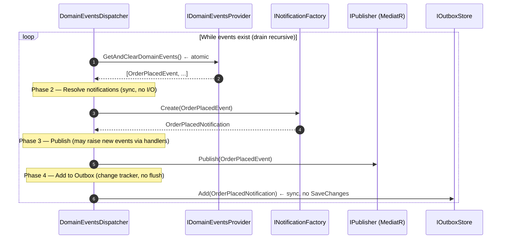
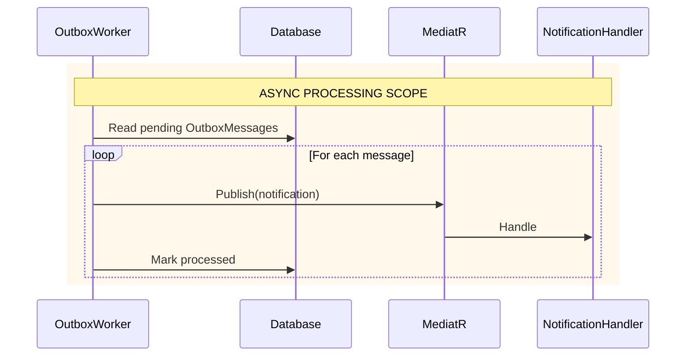

# Transaction Behavior Design — v2

> **Status:** Implementation-ready — waiting on MicroKit.Persistence.EntityFrameworkCore
> (DomainEventsDispatcher) and MicroKit.Messaging (OutboxMessage transport).
> Load this file when working on TransactionBehavior, DomainEventsDispatcher,
> or IOutboxStore.

---

## Architecture Overview — 5 Levels

| Level | Component | Scope | Consistency |
|-------|-----------|-------|-------------|
| 1 | DomainEvent | Business transaction | Synchronous, atomic |
| 2 | DomainEventHandler | Intra-domain consistency | Same DbContext, same transaction |
| 3 | DomainEventNotification + Outbox | Deferred reaction | Persisted atomically, processed async |
| 4 | NotificationHandler + IntegrationMessage | Application orchestration | Async, separate transaction |
| 5 | BrokerWorker | External distributed messaging | At-least-once delivery |

---

## Sequence Diagrams

### 1. Command Flow — Transaction Scope

```mermaid
sequenceDiagram
    autonumber
    actor Client
    participant TB as TransactionBehavior
    participant CH as CommandHandler
    participant OA as OrderAggregate
    participant DD as DomainEventsDispatcher
    participant DH as DomainEventHandler
    participant CA as CustomerAggregate
    participant OS as OutboxStore
    participant UOW as UnitOfWork
    participant DB as Database

    rect rgb(52, 56, 59)
        Note over TB,DB: TRANSACTION SCOPE

        Client->>TB: Send(CreateOrderCommand)
        TB->>CH: Handle(command)
        CH->>OA: Create Order
        OA-->>DD: [via IDomainEventsProvider] OrderPlacedDomainEvent accumulated

        TB->>DD: DispatchEventsAsync()

        loop While events exist
            Note over DD: Phase 1 — GetAndClear (atomic)
            Note over DD: Phase 2 — Resolve notifications
            Note over DD: Phase 3 — Publish (may raise new events)
            DD->>DH: Publish(OrderPlacedDomainEvent)
            DH->>CA: Update Customer loyalty
            CA-->>DD: CustomerPointsGrantedEvent accumulated
            Note over DD: Phase 4 — Add to Outbox (change tracker)
            DD->>OS: Add(OrderPlacedNotification)
        end

        TB->>UOW: CommitAsync()
        UOW->>DB: SaveChanges — aggregates + outbox messages ATOMIC
    end

    TB-->>Client: Result
```



### 2. DomainEventsDispatcher — 4-Phase Loop



### 3. Outbox Processing (async, outside transaction)



---

## Key Interfaces

### IDomainEventsProvider
```csharp
// MicroKit.Domain or MicroKit.Persistence.Abstractions
public interface IDomainEventsProvider
{
    /// <summary>
    /// Returns all accumulated domain events and clears the internal collection atomically.
    /// </summary>
    IReadOnlyList<IDomainEvent> GetAndClearDomainEvents();
}
```

### IDomainEventDispatcher
```csharp
// MicroKit.MediatR.Abstractions
public interface IDomainEventDispatcher
{
    /// <summary>
    /// Dispatches all accumulated domain events in 4 phases:
    /// 1. GetAndClear (atomic), 2. Resolve notifications, 3. Publish, 4. Add to Outbox.
    /// Recursive drain — continues until no new events are raised.
    /// </summary>
    Task DispatchEventsAsync(CancellationToken ct = default);
}
```

### IOutboxStore
```csharp
// MicroKit.Persistence.Abstractions
public interface IOutboxStore
{
    /// <summary>
    /// Adds a notification to the outbox via the EF change tracker.
    /// No SaveChanges — persisted atomically during CommitAsync.
    /// </summary>
    void Add(INotification notification); // sync — change tracker only
}
```

### INotificationFactory
```csharp
// MicroKit.MediatR.Abstractions or MicroKit.Persistence
public interface INotificationFactory
{
    /// <summary>
    /// Resolves the IDomainEventNotification associated with a domain event.
    /// Returns null if no notification is registered for this event type.
    /// </summary>
    IDomainEventNotification<IDomainEvent>? Create(IDomainEvent domainEvent);
}
```

---

## DomainEventsDispatcher — Full Implementation

```csharp
// MicroKit.Persistence.EntityFrameworkCore
public sealed class DomainEventsDispatcher : IDomainEventDispatcher
{
    private readonly IDomainEventsProvider _domainEventsProvider;
    private readonly IPublisher _publisher;           // MediatR IPublisher
    private readonly INotificationFactory _factory;
    private readonly IOutboxStore _outboxStore;
    private bool _isDispatching;                      // reentrancy guard

    public async Task DispatchEventsAsync(CancellationToken ct = default)
    {
        if (_isDispatching) return; // reentrancy — new events accumulate, picked up on return

        _isDispatching = true;
        try
        {
            while (true)
            {
                // Phase 1 — Collect atomically (GetAndClear in one operation)
                var domainEvents = _domainEventsProvider.GetAndClearDomainEvents();
                if (domainEvents.Count == 0) break;

                // Phase 2 — Resolve notifications (sync, no I/O)
                var notifications = new List<IDomainEventNotification<IDomainEvent>>(domainEvents.Count);
                foreach (var domainEvent in domainEvents)
                {
                    var notification = _factory.Create(domainEvent);
                    if (notification is not null)
                        notifications.Add(notification);
                }

                // Phase 3 — Publish domain events (may raise new events via handlers)
                foreach (var domainEvent in domainEvents)
                    await _publisher.Publish(domainEvent, ct).ConfigureAwait(false);

                // Phase 4 — Add notifications to Outbox (change tracker, no flush)
                foreach (var notification in notifications)
                    _outboxStore.Add(notification);
                // → All persisted atomically by CommitAsync in TransactionBehavior
            }
        }
        finally
        {
            _isDispatching = false;
        }
    }
}
```

---

## TransactionBehavior — Final Implementation

```csharp
// MicroKit.MediatR.Behaviors — PipelineOrder 700 (after Retry)
public sealed class TransactionBehavior<TRequest, TResponse>(
    ITransactionalContext transactionalContext,
    IDomainEventDispatcher domainEventDispatcher,
    IUnitOfWork unitOfWork)
    : BehaviorBase<TRequest, TResponse>
    where TRequest : IRequest<TResponse>
{
    public override int Order => PipelineOrder.Transaction; // 700

    public override async ValueTask<TResponse> Handle(
        TRequest request,
        RequestHandlerDelegate<TResponse> next,
        CancellationToken cancellationToken)
    {
        if (request is not ICommand)
            return await next().ConfigureAwait(false);

        var state = new TransactionState(next, domainEventDispatcher, unitOfWork);

        await transactionalContext.ExecuteAsync(
            static async (st, ct) => await ExecuteCommandAsync(st, ct).ConfigureAwait(false),
            state,
            cancellationToken).ConfigureAwait(false);

        return state.Response!;
    }

    private static async Task ExecuteCommandAsync(TransactionState state, CancellationToken ct)
    {
        // Execute the command handler
        state.Response = await state.Next().ConfigureAwait(false);

        // Dispatch domain events — recursive drain + outbox fill
        await state.Dispatcher.DispatchEventsAsync(ct).ConfigureAwait(false);

        // Single commit — aggregates + outbox messages atomic
        await state.UnitOfWork.CommitAsync(ct).ConfigureAwait(false);
    }

    // Closure-free state carrier — avoids heap allocation per pipeline invocation
    private sealed class TransactionState(
        RequestHandlerDelegate<TResponse> next,
        IDomainEventDispatcher dispatcher,
        IUnitOfWork unitOfWork)
    {
        public RequestHandlerDelegate<TResponse> Next { get; } = next;
        public IDomainEventDispatcher Dispatcher { get; } = dispatcher;
        public IUnitOfWork UnitOfWork { get; } = unitOfWork;
        public TResponse? Response { get; set; }
    }
}
```

---

## ITransactionalContext — Correct Signature

```csharp
// MicroKit.Persistence.Abstractions
// ExecuteAsync<TState> pattern — closure-free, EF Core ExecutionStrategy compatible
public interface ITransactionalContext
{
    Task ExecuteAsync<TState>(
        Func<TState, CancellationToken, Task> operation,
        TState state,
        CancellationToken ct = default);
}
```

> **Note:** Current implementation in MicroKit.Persistence.Abstractions uses
> Begin/Commit/Rollback methods — must be updated to this signature before
> TransactionBehavior implementation.

---

## Required Changes to Existing Implementations

### MicroKit.Persistence.Abstractions
- [ ] `ITransactionalContext` — replace Begin/Commit/Rollback with `ExecuteAsync<TState>`
- [ ] `IOutboxStore` — add `void Add(INotification notification)`

### MicroKit.MediatR.Abstractions
- [ ] `IDomainEventDispatcher` — change signature to `DispatchEventsAsync(CancellationToken)`
- [ ] `INotificationFactory` — new interface

### MicroKit.Persistence.EntityFrameworkCore
- [ ] `DomainEventsDispatcher` — implement 4-phase loop with reentrancy guard
- [ ] `EfOutboxStore` — implement `IOutboxStore` via DbSet change tracker

### MicroKit.MediatR.Behaviors
- [ ] `TransactionBehavior` — implement with `ExecuteAsync<TState>` + `TransactionState`
- [ ] `PipelineOrder.Transaction = 700` — add constant

---

## Scope Visualization

```
🔵 BLUE   = Business transaction (synchronous, atomic — same DbContext)
🟠 ORANGE = Async application processing (eventually consistent)
🔴 RED    = External distributed messaging (at-least-once)

Level 1: DomainEvent              🔵 raised during handler
Level 2: DomainEventHandler       🔵 intra-domain side effects
Level 3: DomainEventNotification  🔵 added to Outbox in same transaction
Level 4: OutboxWorker             🟠 reads + publishes async
Level 5: NotificationHandler      🟠 application orchestration
Level 6: IntegrationMessage       🟠→🔴 bridge
Level 7: BrokerWorker             🔴 external transport
```
