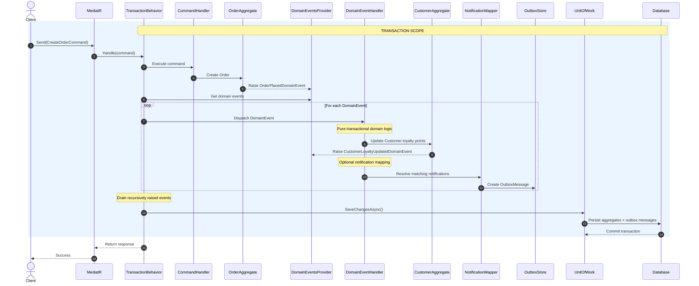
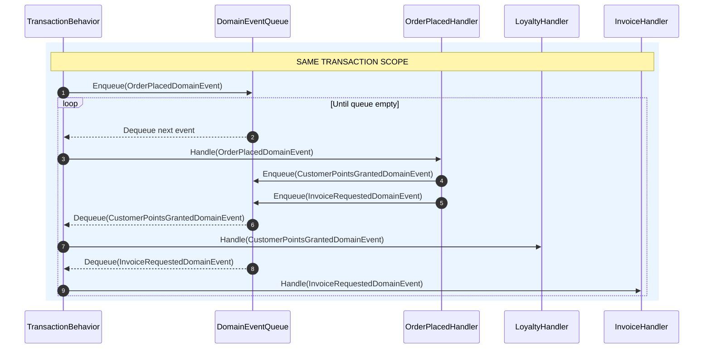
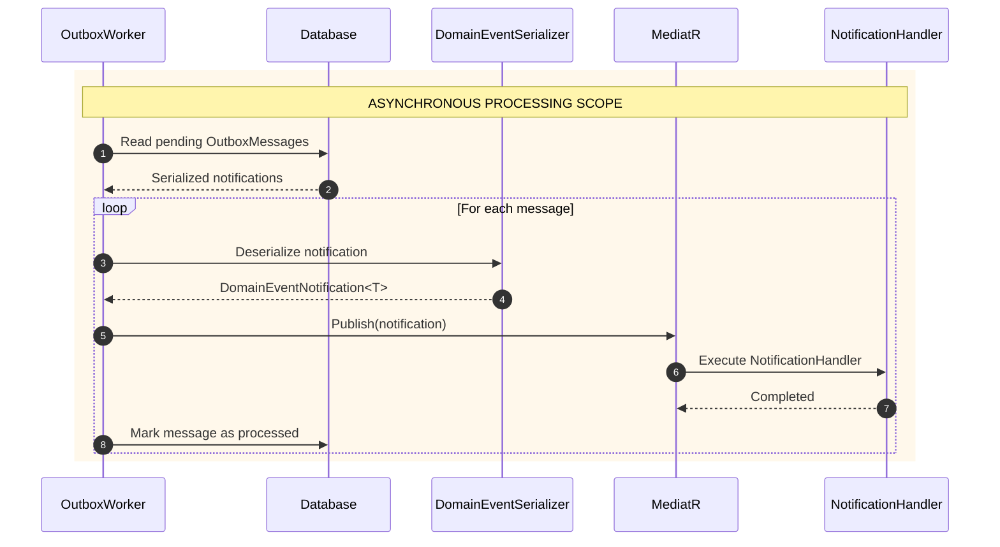
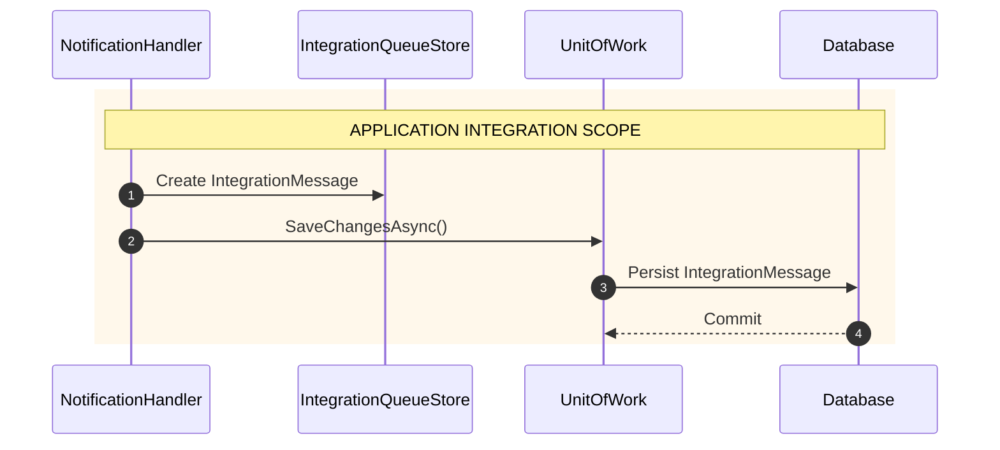
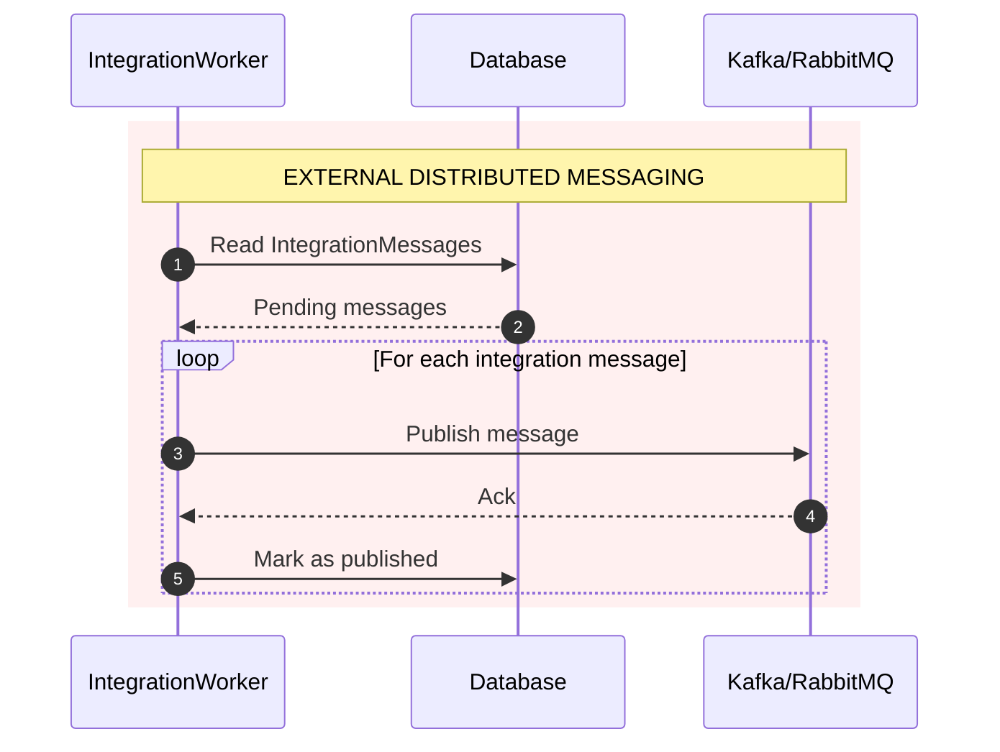
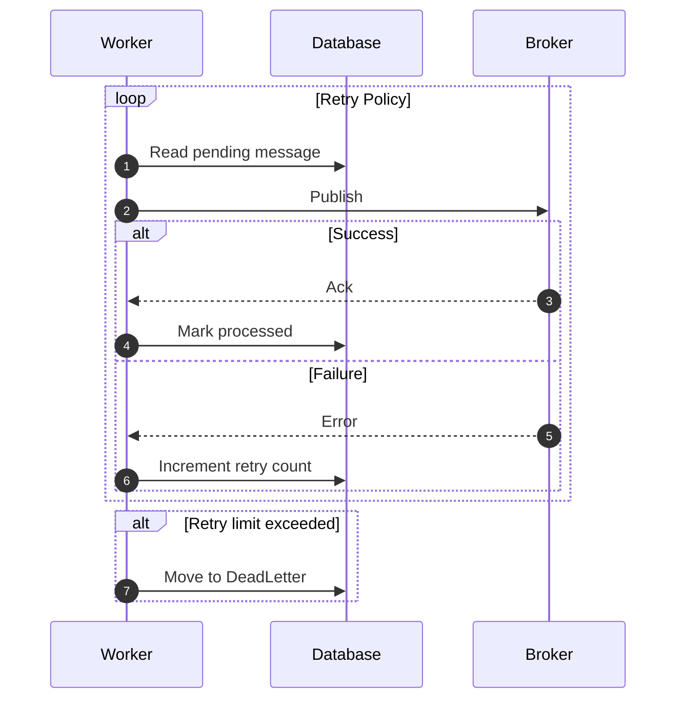

# Transaction Behavior Design

> **Status:** Planned — v2 (depends on MicroKit.Persistence + MicroKit.Messaging)
> **Scope:** This document captures the full architectural design for `TransactionBehavior`
> to be implemented once `MicroKit.Persistence` and `MicroKit.Messaging` are available.
> Load this file when working on TransactionBehavior, MicroKit.Persistence, or MicroKit.Messaging.

---

## Architecture Overview

The system has **5 distinct levels** with clearly separated scopes:

| Level | Component | Scope | Consistency |
|-------|-----------|-------|-------------|
| 1 | DomainEvent | Business transaction | Synchronous, atomic |
| 2 | DomainEventHandler | Intra-domain consistency | Same DbContext, same transaction |
| 3 | DomainEventNotification + Outbox | Deferred reaction | Eventually consistent |
| 4 | NotificationHandler + IntegrationMessage | Application orchestration | Async, separate transaction |
| 5 | BrokerWorker | External distributed messaging | At-least-once delivery |

---

## Sequence Diagrams

### 1. Command Flow — Transaction Scope

The most important diagram. Shows the full transactional boundary:
- Command Handler execution
- Aggregate mutation
- DomainEvent raise
- DomainEventHandler modifying another aggregate **in the same transaction**
- OutboxMessage persisted atomically
- Single SaveChanges + single commit



---

### 2. Recursive Domain Event Draining Flow

Critical: `DomainEventHandler` instances can raise new events during dispatch.
The drain loop must continue until the queue is empty.



---

### 3. Outbox Processing Flow

Outside the business transaction scope — async processing.



---

### 4. Integration Message Flow



---

### 5. Broker Publishing Flow



---

### 6. Failure / Retry / DeadLetter Flow



---

## TransactionBehavior Implementation Design

### Dependencies

```csharp
// Required — from MicroKit.Persistence (not yet implemented)
ITransactionalContext  // wraps the DB transaction
IUnitOfWork            // SaveChangesAsync()

// Required — from MicroKit.MediatR (already available)
IDomainEventDispatcher // dispatch events

// Required — from MicroKit.Domain (already available)
IDomainEventsProvider  // collect events raised during dispatch
```

### Decorator Pattern — IDomainEventsProvider

`IDomainEventsProvider` is implemented as a **decorator** on the DbContext or repositories.
It automatically captures domain events raised by **any** aggregate modified during the transaction —
including aggregates modified by secondary `DomainEventHandler` instances.

This means `IDomainEventsProvider` **fills itself** during `DispatchAsync` — the drain loop
in `TransactionBehavior` picks up newly raised events automatically on the next iteration.

### Correct Recursive Drain Loop

```csharp
private static async ValueTask InvokeCommandAsync(TransactionState state, CancellationToken ct)
{
    // Execute the handler
    state.Response = await state.Next(ct).ConfigureAwait(false);

    // Recursive drain — handlers can raise new events during dispatch
    while (true)
    {
        var events = state.DomainEventsProvider.GetAllDomainEvents();
        if (events.Count == 0) break;

        // Clear BEFORE dispatch — so new events raised during dispatch are captured
        state.DomainEventsProvider.ClearAllDomainEvents();
        await state.Dispatcher.DispatchAsync(events, ct).ConfigureAwait(false);
        // Loop will pick up any newly raised events on next iteration
    }

    // Single SaveChanges — all aggregates + outbox messages persisted atomically
    await state.UnitOfWork.SaveChangesAsync(ct).ConfigureAwait(false);
}
```

### v1 Reference Implementation (annotated)

The following is the v1 draft with corrections applied:

```csharp
/// <summary>
/// Pipeline behavior that wraps command execution in a database transaction,
/// dispatches domain events recursively within the transaction boundary,
/// and persists all changes atomically via <see cref="IUnitOfWork"/>.
/// Query requests bypass the transaction entirely.
/// </summary>
/// <remarks>
/// Requires MicroKit.Persistence (ITransactionalContext, IUnitOfWork) and
/// MicroKit.Messaging (IOutboxStore via DomainEventHandler).
/// PipelineOrder: <see cref="PipelineOrder.Transaction"/> (700 — after Retry).
/// </remarks>
public sealed class TransactionBehavior<TRequest, TResponse>(
    ITransactionalContext transactionalContext,
    IDomainEventsProvider domainEventsProvider,
    IDomainEventDispatcher domainEventDispatcher,
    IUnitOfWork unitOfWork)
    : BehaviorBase<TRequest, TResponse>           // ✅ BehaviorBase, not IPipelineBehavior
    where TRequest : IRequest<TResponse>
{
    public override int Order => PipelineOrder.Transaction; // 700

    public override async ValueTask<TResponse> Handle( // ✅ ValueTask, not Task
        TRequest request,
        RequestHandlerDelegate<TResponse> next,
        CancellationToken cancellationToken)
    {
        // Only wrap commands — queries are read-only, bypass transaction
        if (request is not ICommand)
            return await next().ConfigureAwait(false);

        var state = new TransactionState(next, domainEventsProvider, domainEventDispatcher, unitOfWork);

        await transactionalContext.ExecuteAsync(
            static async (st, ct) => await InvokeCommandAsync(st, ct).ConfigureAwait(false),
            state,
            cancellationToken).ConfigureAwait(false);

        return state.Response!;
    }

    private static async ValueTask InvokeCommandAsync(TransactionState state, CancellationToken ct)
    {
        state.Response = await state.Next().ConfigureAwait(false);

        // Recursive domain event drain
        while (true)
        {
            var events = state.DomainEventsProvider.GetAllDomainEvents();
            if (events.Count == 0) break;
            state.DomainEventsProvider.ClearAllDomainEvents();
            await state.Dispatcher.DispatchAsync(events, ct).ConfigureAwait(false);
        }

        await state.UnitOfWork.SaveChangesAsync(ct).ConfigureAwait(false);
    }

    // Closure-free state carrier — avoids heap allocation per pipeline invocation
    private sealed class TransactionState(
        RequestHandlerDelegate<TResponse> next,
        IDomainEventsProvider domainEventsProvider,
        IDomainEventDispatcher dispatcher,
        IUnitOfWork unitOfWork)
    {
        public RequestHandlerDelegate<TResponse> Next { get; } = next;
        public IDomainEventsProvider DomainEventsProvider { get; } = domainEventsProvider;
        public IDomainEventDispatcher Dispatcher { get; } = dispatcher;
        public IUnitOfWork UnitOfWork { get; } = unitOfWork;
        public TResponse? Response { get; set; }
    }
}
```

### PipelineOrder for TransactionBehavior

```csharp
// Add to PipelineOrder.cs when implementing:
public const int Transaction = 700; // After Retry(600), wraps the full command execution
```

### Open Questions for v2 Implementation

1. **Infinite loop guard** — what if a DomainEventHandler always raises a new event?
   Add a `maxDrainIterations` limit (default: 10) with a clear exception message.

2. **Partial failure** — if `DispatchAsync` fails mid-drain, some events were dispatched
   and some weren't. The transaction rollback handles DB state, but in-memory state
   of `IDomainEventsProvider` may be inconsistent. Needs investigation.

3. **`ITransactionalContext` contract** — to be defined in `MicroKit.Persistence.Abstractions`.
   Must support `ExecuteAsync<TState>(Func<TState, CancellationToken, ValueTask>, TState, CancellationToken)`.

---

## Scope Visualization

```
🔵 BLUE  = Business transaction (synchronous, atomic)
🟠 ORANGE = Async application processing (eventually consistent)
🔴 RED   = External distributed messaging (at-least-once)

Level 1: DomainEvent              🔵 Business transaction
Level 2: DomainEventHandler       🔵 Intra-domain consistency (same DbContext)
Level 3: DomainEventNotification  🔵→🟠 Bridge (Outbox persisted in transaction, processed async)
Level 4: NotificationHandler      🟠 Application orchestration
Level 5: IntegrationMessage       🟠→🔴 Bridge (persisted, then published)
Level 6: BrokerWorker             🔴 External transport
```
