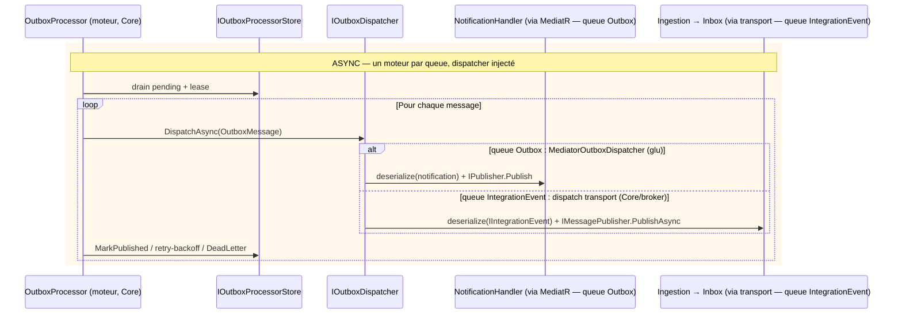

# Transaction Behavior Design — v4

> **Status:** Revised. Aligns the transaction/outbox/notification design with the
> MicroKit.Messaging architecture: MediatR-free Messaging, three queues
> (Outbox / IntegrationEvent / Inbox), a single generic outbox-draining engine in
> Messaging Core driven by a swappable dispatch seam, and the MediatR coupling
> confined to the glue package `MicroKit.MediatR.Messaging`.
>
> Supersedes v3. v3 wrongly typed `IOutboxWriter` on `IIntegrationEvent` and created the
> integration event inside Phase 4. Corrected here.

---

## ⚠ Révision v3 → v4 — décisions appliquées

1. **`IOutboxWriter.AddAsync(OutboxMessage)`** — prend l'entité `OutboxMessage` (Messaging.Abstractions),
   donc **MediatR-free par construction**. Pas d'`IIntegrationEvent` ni d'`IIntegrationEventFactory`
   dans le contrat. `AddAsync` (ValueTask). `TenantId` obligatoire. (Annule l'erreur v3.)
2. **`OutboxMessage` = enveloppe générique** : `EventType` (type CLR) + `Payload` (JSON) + lifecycle/
   lease/retry/corrélation. Dans le flux domaine→outbox, le **Payload est une notification sérialisée**.
3. **Phase 4 du dispatcher = persister les notifications** (construites en `OutboxMessage`). Elle ne crée
   PAS d'IntegrationEvent. La **décision d'émettre un IntegrationEvent appartient aux
   `NotificationHandler`**, en aval.
4. **Trois queues** : `Outbox` (notifications), `IntegrationEvent` (cross-module), `Inbox` (réception).
5. **Drainer Outbox→MediatR = split** : le **moteur de drain générique reste dans Messaging Core**
   (MediatR-free : drain + lease + back-off + retry + dead-letter), appelant une **couture de dispatch
   `IOutboxDispatcher`**. L'**impl de dispatch « republish notification via MediatR » vit dans la glu**
   `MicroKit.MediatR.Messaging`.
6. **`DomainEventsDispatcher`** vit dans la glu (pas Persistence — éviterait un cycle Messaging↔Persistence).
7. **`EfOutboxWriter`** vit dans `MicroKit.Messaging.EntityFrameworkCore` (réutilise
   `MicroKit.Persistence.EntityFrameworkCore`). Direction `Messaging → Persistence` (autorisée).

### À trancher (non figé)

- **Wording des commentaires XML d'`OutboxMessage`** : ils disent « integration event » alors qu'on y
  stocke une notification. Réconcilier : enveloppe générique (corriger le wording → « event ») **ou**
  entité distincte par queue. Lié à la question ci-dessous.
- **`Outbox` et `IntegrationEvent` partagent-ils l'entité `OutboxMessage`** (deux tables, même type) **ou
  deux entités distinctes** ? Le moteur générique se registre une fois par store, dans les deux cas.
- **Placement de `TransactionBehavior`** : `MicroKit.MediatR.Behaviors` (implique `MediatR → Persistence.
  Abstractions`) ou la glu. Décision module à acter.
- **Optimisations proposées, non décidées** : réveil signal-driven (`Channel` + PostgreSQL `LISTEN/NOTIFY`)
  vs polling ; ordre/partition ; `traceparent` W3C sur l'enveloppe (tu as déjà `CorrelationId`/`CausationId`) ;
  sérialisation JSON source-generated.

---

## Niveaux & trois queues

| Niveau | Composant | Queue | Cohérence |
|-------|-----------|-------|-----------|
| 1 | `DomainEvent` | — | Synchrone, atomique |
| 2 | `DomainEventHandler` | — | Même DbContext, même transaction |
| 3 | Outbox (notifications) | **Outbox** | Persisté atomiquement, traité async |
| 4 | Moteur drain + `MediatorOutboxDispatcher` → `NotificationHandler` | **Outbox** | Async, MediatR in-process |
| 5 | `NotificationHandler` décide → `IntegrationEvent` | **IntegrationEvent** | Async, transaction séparée |
| 6 | Moteur drain + dispatch transport (`IMessagePublisher`) → ingestion | **IntegrationEvent** | At-least-once |
| 7 | Ingestion → `InboxMessage` → `InboxProcessor` → `IMessageHandler` | **Inbox** | Exactly-once par consumer |

> Le **même moteur de drain** (Core) sert les queues Outbox et IntegrationEvent ; seul le `IOutboxDispatcher`
> injecté change (republish MediatR vs transport).

---

## Module placement (canonique)

```txt
MicroKit.Domain.Abstractions
  └─ IDomainEvent, IDomainEventsProvider

MicroKit.MediatR.Abstractions
  └─ IDomainEventDispatcher, INotificationFactory, IDomainEventNotification   (zéro Messaging)

MicroKit.Persistence.Abstractions
  └─ IUnitOfWork, ITransactionalContext                                       (MediatR-free, Messaging-free)

MicroKit.Messaging.Abstractions                                              (MediatR-free)
  └─ IOutboxWriter, IOutboxProcessorStore, IOutboxDispatcher, IInboxStore,
     OutboxMessage, InboxMessage, IIntegrationEvent, MessageEnvelope<T>

MicroKit.Messaging  (Core)                                                   (MediatR-free)
  ├─ OutboxProcessor          ← MOTEUR générique (drain+lease+retry+deadletter → IOutboxDispatcher)
  ├─ InProcessIntegrationDispatcher : IOutboxDispatcher  (deserialize→IIntegrationEvent→IMessagePublisher)
  ├─ InProcessMessagePublisher, ingestion, InboxProcessor

MicroKit.Messaging.EntityFrameworkCore  (réutilise Persistence.EntityFrameworkCore)  (MediatR-free)
  └─ EfOutboxWriter, EfOutboxProcessorStore, EfInboxStore

MicroKit.MediatR.Messaging  (GLU — seul point de rencontre MediatR ↔ Messaging)
  ├─ DomainEventsDispatcher                  (implémente IDomainEventDispatcher)
  ├─ MediatorOutboxDispatcher : IOutboxDispatcher  (deserialize→notification→IPublisher.Publish)  ← MediatR
  └─ deps : MediatR + MediatR.Abstractions + Messaging.Abstractions + Domain.Abstractions + Persistence.Abstractions
```

**Zéro cycle.** La glu est volontairement non-autonome (composition) ; les cores restent purs.

---

## La couture de dispatch (cœur de la décision)

```csharp
// MicroKit.Messaging.Abstractions  — MediatR-free
public interface IOutboxDispatcher
{
    /// <summary>
    /// Dispatches a single outbox message. The engine is payload-agnostic; the
    /// implementation deserializes (by EventType) and publishes.
    /// </summary>
    ValueTask DispatchAsync(OutboxMessage message, CancellationToken ct = default);
}
```

- **Moteur (Core, MediatR-free)** : `OutboxProcessor` draine `IOutboxProcessorStore`, pose le lease,
  appelle `IOutboxDispatcher.DispatchAsync(message)`, puis `MarkPublished` / retry-backoff / `DeadLetter`.
  Il ne désérialise rien et ne connaît ni MediatR ni le transport.
- **Dispatch Outbox-notifications (glu, MediatR-aware)** : `MediatorOutboxDispatcher` désérialise le payload
  (notification) par `EventType` et appelle `IPublisher.Publish`.
- **Dispatch IntegrationEvent (Core/broker, MediatR-free)** : désérialise en `IIntegrationEvent` et appelle
  `IMessagePublisher.PublishAsync` (in-process v1 / broker v2) → ingestion → Inbox.

Le moteur est enregistré une fois par queue, avec son `(store, dispatcher)`.

---

## Sequence Diagrams

### 1. Command Flow — Transaction Scope

```mermaid
sequenceDiagram
    autonumber
    actor Client
    participant TB as TransactionBehavior
    participant CH as CommandHandler
    participant OA as Aggregate
    participant DD as DomainEventsDispatcher
    participant DH as DomainEventHandler
    participant OW as IOutboxWriter
    participant UOW as UnitOfWork
    participant DB as Database

    rect rgb(52, 56, 59)
        Note over TB,DB: TRANSACTION SCOPE (atomique)
        Client->>TB: Send(Command)
        TB->>CH: Handle(command)
        CH->>OA: muter l'agrégat
        OA-->>DD: [via IDomainEventsProvider] DomainEvent accumulé
        TB->>DD: DispatchEventsAsync()
        loop Drain récursif
            Note over DD: P1 GetAndClear · P2 Resolve notifications · P3 Publish (intra-domaine)
            DD->>DH: Publish(DomainEvent)
            Note over DD: P4 — notification → OutboxMessage → AddAsync (change tracker)
            DD->>OW: AddAsync(OutboxMessage)
        end
        TB->>UOW: CommitAsync()
        UOW->>DB: SaveChanges — agrégats + OutboxMessages ATOMIQUES
    end
    TB-->>Client: Result
```



### 2. DomainEventsDispatcher — boucle 4 phases

```mermaid
sequenceDiagram
    autonumber
    participant DD as DomainEventsDispatcher
    participant DEP as IDomainEventsProvider
    participant NF as INotificationFactory
    participant PUB as IPublisher (MediatR)
    participant OW as IOutboxWriter

    loop Drain récursif
        DD->>DEP: GetAndClearDomainEvents()
        DEP-->>DD: [DomainEvent, ...]
        Note over DD: P2 — Resolve notifications (sync)
        DD->>NF: Create(DomainEvent)
        NF-->>DD: notification (peut être null)
        Note over DD: P3 — Publish (intra-domaine; peut lever de nouveaux events)
        DD->>PUB: Publish(DomainEvent)
        Note over DD: P4 — notification → OutboxMessage → AddAsync (no flush)
        DD->>OW: AddAsync(OutboxMessage(notification))
    end
```

### 3. Drain (async) — moteur unique, dispatch swappable



---

## Key Interfaces

### IOutboxWriter (signature actée)
```csharp
namespace MicroKit.Messaging; // Messaging.Abstractions — MediatR-free
public interface IOutboxWriter
{
    /// <summary>
    /// Adds an outbox message within the current domain transaction.
    /// Not persisted until the enclosing transaction commits.
    /// OutboxMessage.TenantId must not be null or empty.
    /// </summary>
    ValueTask AddAsync(OutboxMessage message, CancellationToken ct = default);
}
```

### OutboxMessage (enveloppe générique — payload = notification dans le flux domaine→outbox)
```csharp
namespace MicroKit.Messaging;
// sealed class (pas record) : EF Core exige des { get; set; } mutables.
// TenantId obligatoire (jamais null/empty) — les processors lisent le tenant ici, pas via IHttpContextAccessor.
// CorrelationId non-nullable (CorrelationId.New() si pas d'amont).
public sealed class OutboxMessage
{
    public MessageId Id { get; set; } = null!;
    public string TenantId { get; set; } = null!;
    public string EventType { get; set; } = null!;   // event type ()
    public string Payload { get; set; } = null!;      // JSON — notification sérialisée dans le flux Outbox (MessageEnvelope)
    public OutboxMessageStatus Status { get; set; }
    public int RetryCount { get; set; }
    public DateTimeOffset OccurredOnUtc { get; set; }
    public DateTimeOffset CreatedAtUtc { get; set; }
    public DateTimeOffset? ProcessedAtUtc { get; set; }
    public DateTimeOffset? LockedUntilUtc { get; set; }
    public DateTimeOffset? NextRetryAtUtc { get; set; } // back-off 2^RetryCount s, cap 3600 s
    public string? ErrorMessage { get; set; }
    public bool DeadLettered { get; set; }              // true quand Status = Failed
    public CorrelationId CorrelationId { get; set; } = null!;
    public CausationId? CausationId { get; set; }
}
```

### IDomainEventsProvider / IDomainEventDispatcher / INotificationFactory
```csharp
// MicroKit.Domain.Abstractions
public interface IDomainEventsProvider
{
    IReadOnlyList<IDomainEvent> GetAndClearDomainEvents(); // atomic
}

// MicroKit.MediatR.Abstractions
public interface IDomainEventDispatcher
{
    Task DispatchEventsAsync(CancellationToken ct = default); // 4 phases, drain récursif
}

// MicroKit.MediatR.Abstractions — réaction in-process intra-domaine
public interface INotificationFactory
{
    IDomainEventNotification<IDomainEvent>? Create(IDomainEvent domainEvent); // null si aucune
}
```

---

## DomainEventsDispatcher — implémentation (glu)

```csharp
// MicroKit.MediatR.Messaging
public sealed class DomainEventsDispatcher : IDomainEventDispatcher
{
    private readonly IDomainEventsProvider _domainEventsProvider;
    private readonly IPublisher _publisher;                 // MediatR IPublisher
    private readonly INotificationFactory _notificationFactory;
    private readonly IOutboxWriter _outboxWriter;           // Messaging.Abstractions
    private readonly IOutboxMessageMapper _mapper;          // notification → OutboxMessage (glu)
    private bool _isDispatching;                            // reentrancy guard

    public async Task DispatchEventsAsync(CancellationToken ct = default)
    {
        if (_isDispatching) return; // new events accumulate, picked up on return
        _isDispatching = true;
        try
        {
            while (true)
            {
                // P1 — collect atomically
                var domainEvents = _domainEventsProvider.GetAndClearDomainEvents();
                if (domainEvents.Count == 0) break;

                // P2 — resolve in-process notifications
                var notifications = new List<IDomainEventNotification<IDomainEvent>>(domainEvents.Count);
                foreach (var e in domainEvents)
                {
                    var n = _notificationFactory.Create(e);
                    if (n is not null) notifications.Add(n);
                }

                // P3 — publish domain events (intra-domain handlers; may raise new events)
                foreach (var e in domainEvents)
                    await _publisher.Publish(e, ct).ConfigureAwait(false);

                // P4 — notification → OutboxMessage → outbox (change tracker, no flush)
                foreach (var n in notifications)
                {
                    var message = _mapper.ToOutboxMessage(n); // EventType + JSON payload + TenantId + CorrelationId
                    await _outboxWriter.AddAsync(message, ct).ConfigureAwait(false);
                }
                // → persisté atomiquement par CommitAsync dans TransactionBehavior
            }
        }
        finally { _isDispatching = false; }
    }
}
```

> `IOutboxMessageMapper` (glu) sérialise la notification et renseigne `EventType`, `Payload`, `TenantId`,
> `CorrelationId`, `OccurredOnUtc`. C'est le seul endroit qui « connaît » la notification ; `IOutboxWriter`
> ne voit qu'un `OutboxMessage`.

---

## TransactionBehavior (placement à acter)

```csharp
// PipelineOrder.Transaction = 700 (after Retry)
public sealed class TransactionBehavior<TRequest, TResponse>(
    ITransactionalContext transactionalContext,
    IDomainEventDispatcher domainEventDispatcher,
    IUnitOfWork unitOfWork)
    : BehaviorBase<TRequest, TResponse>
    where TRequest : IRequest<TResponse>
{
    public override int Order => PipelineOrder.Transaction;

    public override async ValueTask<TResponse> Handle(
        TRequest request, RequestHandlerDelegate<TResponse> next, CancellationToken ct)
    {
        if (request is not ICommand) return await next().ConfigureAwait(false);
        var state = new TransactionState(next, domainEventDispatcher, unitOfWork);
        await transactionalContext.ExecuteAsync(
            static (st, c) => ExecuteCommandAsync(st, c), state, ct).ConfigureAwait(false);
        return state.Response!;
    }

    private static async Task ExecuteCommandAsync(TransactionState s, CancellationToken ct)
    {
        s.Response = await s.Next().ConfigureAwait(false);
        await s.Dispatcher.DispatchEventsAsync(ct).ConfigureAwait(false); // drain + outbox fill
        await s.UnitOfWork.CommitAsync(ct).ConfigureAwait(false);          // single atomic commit
    }

    private sealed class TransactionState(
        RequestHandlerDelegate<TResponse> next, IDomainEventDispatcher dispatcher, IUnitOfWork unitOfWork)
    {
        public RequestHandlerDelegate<TResponse> Next { get; } = next;
        public IDomainEventDispatcher Dispatcher { get; } = dispatcher;
        public IUnitOfWork UnitOfWork { get; } = unitOfWork;
        public TResponse? Response { get; set; }
    }
}
```

---

## Required Changes (par module)

### MicroKit.Persistence.Abstractions
- [ ] `ITransactionalContext` — migrer Begin/Commit/Rollback → `ExecuteAsync<TState>`

### MicroKit.MediatR.Abstractions
- [ ] `IDomainEventDispatcher` — `DispatchEventsAsync(CancellationToken)`
- [ ] `INotificationFactory`

### MicroKit.Messaging.Abstractions
- [ ] `IOutboxWriter.AddAsync(OutboxMessage)` (acté)
- [ ] `IOutboxDispatcher.DispatchAsync(OutboxMessage)` (NOUVEAU — couture moteur↔dispatch)
- [ ] Réconcilier le wording XML d'`OutboxMessage` (event générique vs integration event)

### MicroKit.Messaging (Core)
- [ ] `OutboxProcessor` = moteur générique drain+lease+retry+deadletter → `IOutboxDispatcher` (MediatR-free)
- [ ] `InProcessIntegrationDispatcher : IOutboxDispatcher` (deserialize→IIntegrationEvent→IMessagePublisher)

### MicroKit.Messaging.EntityFrameworkCore (réutilise Persistence.EFCore)
- [ ] `EfOutboxWriter`, `EfOutboxProcessorStore`, `EfInboxStore`

### MicroKit.MediatR.Messaging (glu — NOUVEAU)
- [ ] `DomainEventsDispatcher` (4 phases + reentrancy guard)
- [ ] `IOutboxMessageMapper` (notification → OutboxMessage)
- [ ] `MediatorOutboxDispatcher : IOutboxDispatcher` (deserialize→notification→IPublisher.Publish)

### MicroKit.MediatR.Behaviors (ou glu — placement à acter)
- [ ] `TransactionBehavior` + `PipelineOrder.Transaction = 700`

---

## Impact sur le plan Messaging Core v1

Le `OutboxProcessor` de Core devient un **moteur générique** : il ne désérialise plus et n'appelle plus
directement `IMessagePublisher`/`IMessageSerializer`. Il appelle `IOutboxDispatcher`. La désérialisation +
`IMessagePublisher` descendent dans `InProcessIntegrationDispatcher : IOutboxDispatcher` (Core). C'est ce
qui permet de réutiliser le même moteur pour la queue Outbox (dispatch MediatR, dans la glu). À répercuter
dans le plan Core avant implémentation.

---

## Invariants

- **Atomicité** : agrégats + `OutboxMessage` committés ensemble (un seul `SaveChanges`).
- **Messaging MediatR-free** : aucun type MediatR dans `Messaging.*`. La glu est le seul pont.
- **Zéro cycle** : `Messaging → Persistence` uniquement ; la glu au-dessus de tout.
- **Un moteur, deux queues** : `OutboxProcessor` générique, dispatch injecté par queue.
- **Broker-ready** : seul le dispatcher transport change entre in-process (v1) et broker (v2).
